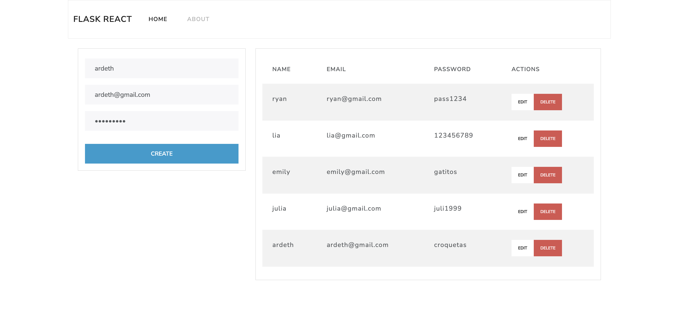

### 🐍⚛️ Python + React
A fullstack application for managing users. Backend was developed with Flask and MongoDB, and the Frontend, uses React with Bootstrap. 


### ⚡️ Backend
Installation:
```
cd backend
python3 -m venv venv
source venv/bin/activate
```

For running backend:
```
python src/app.py
```

### 🎨 Frontend
Installation:
```
cd frontend
npm install
```

For running React excute this:
```
npm run dev
```

### 💚 Mongo + Mongo-Express
MongoDB can be run with Docker. I also added Mongo Express as support. Create an `.env` file, follwing `.env.example` and then run:
```
docker-compose up -d
```
